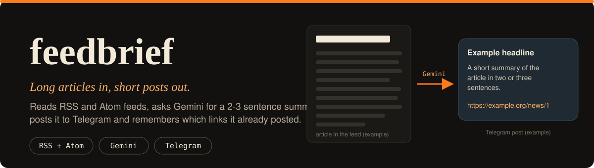
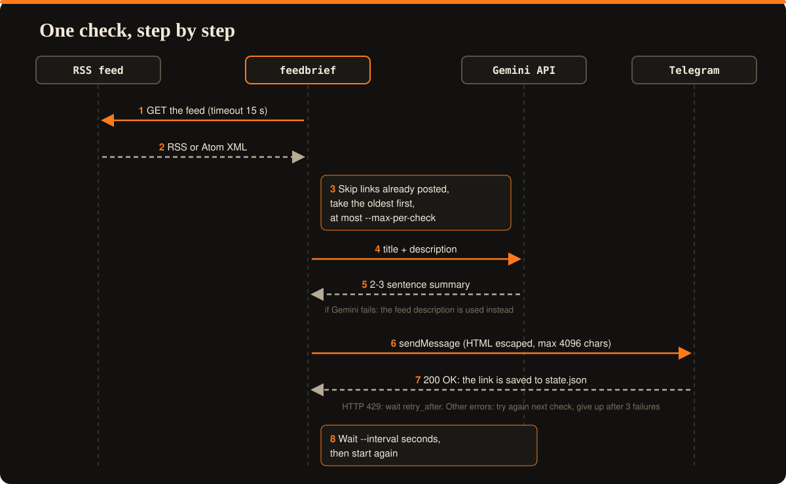
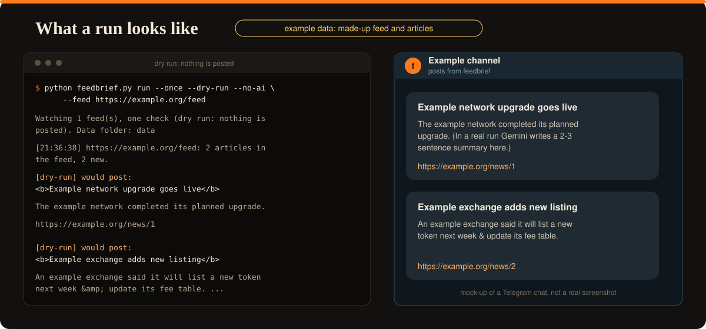

  

# feedbrief

A small bot that watches RSS or Atom news feeds, asks Google's Gemini API for a 2-3 sentence summary of every new article, and posts the summary with a link to a Telegram chat or channel. Links it already posted are remembered, so nothing is sent twice.

The default feed is CoinDesk's crypto news, but any RSS 2.0 or Atom feed works.

## Quick start

1. Create a Telegram bot with [@BotFather](https://t.me/BotFather) and copy its token.
2. Message your bot once, then open `https://api.telegram.org/bot<TOKEN>/getUpdates` and find your chat ID.
3. Get a free Gemini API key at [aistudio.google.com/apikey](https://aistudio.google.com/apikey).
4. Install:

        git clone https://github.com/vantacorehq/feedbrief.git
        cd feedbrief
        pip install -r requirements.txt

5. Copy `.env.example` to `.env` and fill in the three values (you can also set them as environment variables):

        TELEGRAM_BOT_TOKEN=your_telegram_bot_token_here
        TELEGRAM_CHAT_ID=your_chat_id_here
        GEMINI_API_KEY=your_gemini_api_key_here

6. Check that posting works, then look at what the bot would post:

        python feedbrief.py test-telegram
        python feedbrief.py run --once --dry-run

7. Start it (stop with Ctrl+C):

        python feedbrief.py run

## How it works

## Examples

    python feedbrief.py run --once
    python feedbrief.py run --from-now
    python feedbrief.py run --feed https://example.org/feed --topic "space news"
    python feedbrief.py run --feed https://a.example/feed --feed https://b.example/feed --interval 1800
    python feedbrief.py run --once --dry-run --no-ai

The picture shows a made-up feed and made-up articles. The Telegram part is a mock-up, not a real screenshot.

## Options of `run`

- `--feed`: RSS or Atom URL, repeat it for several feeds (default: CoinDesk crypto news)
- `--interval`: seconds between checks (default `900`)
- `--max-per-check`: most articles to post per feed per check (default `3`)
- `--delay`: seconds between Telegram messages (default `5`)
- `--once`: run a single check and exit
- `--from-now`: on the first check of a feed, skip the articles already in it
- `--dry-run`: print the messages instead of posting them, needs no Telegram keys
- `--no-ai`: skip Gemini and post the feed description, needs no Gemini key
- `--topic`: audience for the summary prompt (default `crypto and web3`)
- `--model`: Gemini model (default `gemini-flash-latest`)
- `--data-dir`: folder for the state file (default `data`)

## Good to know

- Articles are posted oldest first. If more than `--max-per-check` are new, the rest follow in the next checks.
- State lives in `data/state.json` (the last 500 posted links). Delete it to start over.
- If posting to Telegram fails, the article is tried again at the next check, and skipped after 3 failed attempts. Connection errors, HTTP 429 (it waits the time Telegram asks for, up to 60 seconds) and HTTP 5xx are retried right away.
- If Gemini fails, the first 300 characters of the feed description are posted instead.
- Messages are HTML-escaped and shortened to Telegram's 4096 character limit.
- The article text is sent to Gemini inside the prompt and marked as untrusted data.
- Feeds are read with the standard library: RSS 2.0 and Atom are supported. A feed that is not valid XML is skipped with an error message.
- Summaries are written by an AI and can contain mistakes. They are not financial advice, check the source link.
- Posting directly to X/Twitter needs a paid developer API plan, so this bot targets Telegram, which is free. `TelegramClient` in `fb_telegram.py` can be swapped for another destination.

## Tests

    python -m unittest discover -s . -p "test_*.py"

62 tests cover feed parsing, the Gemini and Telegram clients (with retries and rate limits), state, the posting logic and the command line. Network calls are mocked, so the real services are not called. Tested with Python 3.12.

## Files

- `feedbrief.py`: commands and options, run this file
- `fb_bot.py`: one check of the feeds and the main loop
- `fb_feed.py`: downloads and parses RSS and Atom feeds
- `fb_gemini.py`: summaries with Gemini
- `fb_telegram.py`: message formatting and posting to Telegram
- `fb_state.py`: remembers posted links
- `fb_config.py`: keys from the environment or `.env`
- `test_*.py`, `helpers_fakes.py`: unit tests
- `assets/`: images for this README

## Need a custom bot?

Open for freelance work: bots, scraping and automation projects. DM me on X: [@vantacorehq](https://x.com/vantacorehq)
